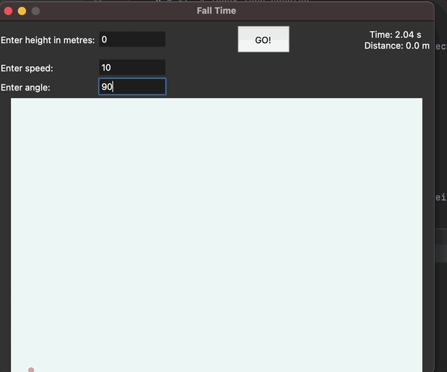

# Fall-Time
A fun 2-D projectile motion simulator made with Tkinter

The program creates a visual representation of a 2-D projectile by taking in 3 parameters: Height, Speed, Angle and then applies them to basic kinematics formulas.

Height refers to the starting point of the projectile, while speed and angle are used to produce the velocity vector of the projectile. 

## GUI

The GUI was created with Tkinter and renders a 2-D projectile on its trajectory in real-time, the boundaries of the canvas scale depending on either the maximum height or the distance travelled horizontally, which ever is greater. This way it is ensured that the projectile never leaves the canvas. 

## Future Plans

1. Add air resistance for the projectile where information like **mass**, **projectile radius**, **area**, and **drag coefficient** are entered through the GUI for users
2. Add a plot behind the projectile
3. Create a target for the user to hit
